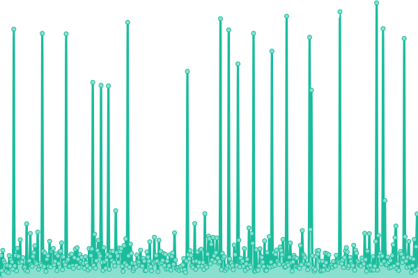
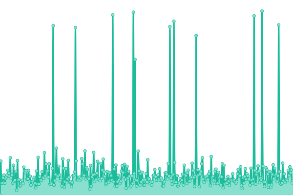

# [📈 Live Status](https://status.community-lores.gq): <!--live status--> **🟩 All systems operational**

This repository contains the open-source uptime monitor and status page for [Community Lores | The Pins Team](https://community-lores.gq), powered by [Upptime](https://github.com/upptime/upptime).

With [Upptime](https://upptime.js.org), you can get your own unlimited and free uptime monitor and status page, powered entirely by a GitHub repository. We use [Issues](https://github.com/Community-Lores/status-page/issues) as incident reports, [Actions](https://github.com/Community-Lores/status-page/actions) as uptime monitors, and [Pages](https://status.community-lores.gq) for the status page.

<!--start: status pages-->
<!-- This summary is generated by Upptime (https://github.com/upptime/upptime) -->
<!-- Do not edit this manually, your changes will be overwritten -->
<!-- prettier-ignore -->
| URL | Status | History | Response Time | Uptime |
| --- | ------ | ------- | ------------- | ------ |
|  [Community Lores Homepage](https://lorebooks.eu.org) | 🟩 Up | [community-lores-homepage.yml](https://github.com/lorebooks-wiki/status-page/commits/HEAD/history/community-lores-homepage.yml) | 

 288ms
     
 | 

<a href="https://status.community-lores.gq/history/community-lores-homepage">100.00%</a>
    

|  [Recap Time Squad Wiki](https://squad.lorebooks.eu.org) | 🟩 Up | [recap-time-squad-wiki.yml](https://github.com/lorebooks-wiki/status-page/commits/HEAD/history/recap-time-squad-wiki.yml) | 

 274ms
     
 | 

<a href="https://status.community-lores.gq/history/recap-time-squad-wiki">0.00%</a>
    

<!--end: status pages-->

[**Visit our status website →**](https://status.community-lores.gq)

## 📄 License

- Powered by: [Upptime](https://github.com/upptime/upptime)
- Code: [MIT](./LICENSE) © [Community Lores | The Pins Team](https://community-lores.gq)
- Data in the `./history` directory: [Open Database License](https://opendatacommons.org/licenses/odbl/1-0/)
